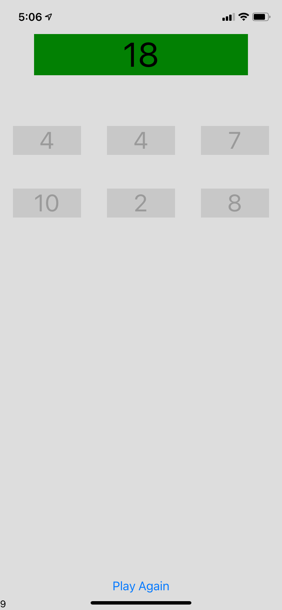

# Target Sum

In this game, the target number appears at the top and there are six numbers below it. The goal is to select the numbers that add up to the target. You have 10 seconds each time. This app was built using React Native, so it can work on iOS, Android, or the web.

| Web |
:-----:

| iOS | Android |
:-------------------------:|:-------------------------:
 | 

## How to Run

1. [Clone](https://github.com/Abhiek187/TargetSum.git) this repo, `cd TargetSum`

2. `npm install`

3. Run `npm start` to bring up the Expo GUI and follow the steps to run on your respective platform.
